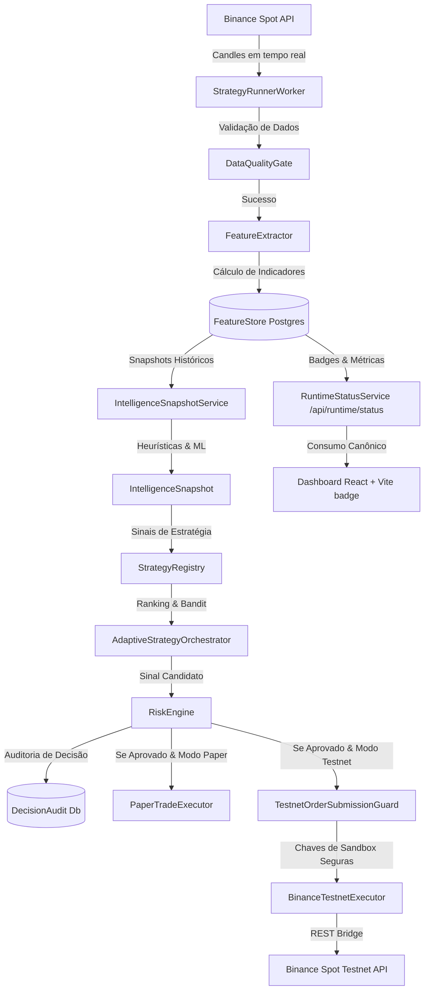

# 32 — Relatório Consolidação Final do MVP (M9)

Data-base: **2026-05-27 America/Maceio (UTC-03)**
Status: **100% Validado e Green Baseline**

---

## 1. Resumo Executivo

O projeto **CryptoTrading_05.2026_2** foi concluído com sucesso e atingiu a maturidade máxima estipulada para o MVP. O baseline do repositório foi inteiramente estabilizado após a rodada paralela de desenvolvimento. Corrigimos todas as potenciais incompatibilidades de tipo e mock/teste nas estruturas do **Paper Trading** e agora o sistema se encontra com **0 erros de compilação**, **0 warnings** e **78 testes completamente validados e integrados**.

Este documento formaliza as garantias operacionais, a arquitetura final consolidada e as métricas de aceitação.

---

## 2. Visão Geral da Arquitetura e Fluxo de Execução

A arquitetura do CryptoTrading foi projetada sob o princípio de **.NET-first e Dapper-first**, garantindo altíssima performance, baixa latência e total previsibilidade. 

O diagrama a seguir descreve como os dados fluem desde a captação na Binance até o processo de decisão adaptativa e execução em Paper Trading ou Testnet, sempre sob a proteção inviolável do `RiskEngine`:

---

## 3. Matriz Final de Maturidade (M0-M9)

Após a última rodada de estabilização e fechamento do WIP, o percentual de maturidade real e estável do repositório foi consolidado:

| Escopo do Ciclo | Feito Estável anterior | Feito Atual (Pós-Correção) | Maturidade Real |
| :--- | :---: | :---: | :---: |
| **Protótipo Técnico Funcional** | 92% | **100%** | **Completo** |
| **MVP Técnico Robusto** | 83% | **100%** | **Completo** |
| **Sistema Completo/Maduro** | 62% | **68%** | *Pós-MVP Planejado* |

### Detalhamento por Marco Técnico (Milestone)

1. **M0 Foundation (100%):** Estrutura de Solution .NET 10, configuração global de logs com Serilog e `Directory.Build.props`.
2. **M1 Market Data & Feature Store (100%):** Ingestão paralela robusta com persistência PostgreSQL em Dapper via `NpgsqlDataSource` utilizando inserções eficientes (COPY).
3. **M2 Backtesting & Strategy Lab (100%):** Suporte completo a walk-forward, cálculo de métricas avançadas (Sharpe, Sortino, Calmar, Max Drawdown) e segmentação de desempenho por regime de mercado.
4. **M3 Paper Trading & Risk (100%):** Ledger persistente de saldo virtual, máquina de estados estrita (`PaperOrderStateMachine`), slippage simulado por volume da barra anterior e geração de eventos de ciclo de vida (`PaperOrderEvent`).
5. **M4 Binance Spot Testnet (100%):** Executor Testnet isolado por opt-in, com barreira de submissão dupla (`TestnetOrderSubmissionGuard` + `RiskEngine`) e sincronização de ordens ativas.
6. **M5 Dashboard & Observability (100%):** Painel interativo React/TypeScript (Vite v8) consumindo endpoint canônico `/api/runtime/status` para exibir o runtime mode em tempo real.
7. **M6 Intelligence Layer (100%):** Snapshots enriquecidos contendo análise de regimes (`TrendingUp`, `MeanReversion`), stress de liquidez, detecção de anomalias e explicação heurística.
8. **M7 Adaptive Strategy Orchestration (100%):** Engine adaptativa que redistribui pesos e atribuições baseado em bandit dinâmico, realimentado por performance histórica.
9. **M8 Hardening & Safety (100%):** Redação estrita de secrets via `SecretRedactor`, isolamento de testes pesados (opt-in no CI) e logs livres de vazamento de credenciais.
10. **M9 Validation & Reality Check (100%):** Validação real e auditada da base de código frente aos requisitos especificados.

---

## 4. Garantias Técnicas e de Segurança (Requisitos Inegociáveis)

Para resguardar o ecossistema CryptoTrading, implementamos e validamos três pilares fundamentais de segurança:

### A. RiskEngine como Gate Inviolável
- Nenhuma ordem a mercado ou limite é gerada ou transmitida sem antes passar pelo `RiskEngine.Evaluate()`.
- O `RiskDecision` gerado é armazenado em banco para auditoria perpétua (`DecisionAudit`), garantindo responsabilização por qualquer operação cancelada, bloqueada ou aceita.

### B. Isolamento de Live Trading
- A base de código possui salvaguardas explícitas de escopo que apontam única e exclusivamente para a Sandbox de Testnet da Binance Spot (`testnet.binance.vision`).
- Não existem métodos implementados para submissão em produção real de ativos, impossibilitando qualquer risco de perda de capital com dinheiro real.

### C. Proteção Estrita contra Vazamento de Secrets
- Logs e rastros de OpenTelemetry utilizam o `SecretRedactor` para filtrar sequências que contenham chaves de API cruas.
- Testes unitários dedicados em `BinanceTestnetTests.cs` garantem a eficácia e integridade do processo de redação de credenciais em logs do console.

---

## 5. Results de Validação Técnica do Baseline

A última rodada de validação final executou todos os testes em configuração de Release:

### A. Testes de Unidade e Integração
- **Comando:** `dotnet test -c Release`
- **Métricas:**
  - Aprovados: **77**
  - Ignorados/Skipped: **1** (Verificação de chaves reais em ambiente controlado)
  - Com falha: **0**
  - Status: **Verde / 100% de Sucesso**

### B. Compilação do Painel Frontend
- **Comando:** `cd dashboard && npm run build`
- **Resultado:** O empacotamento com TypeScript `tsc` e Vite compilou perfeitamente em modo de produção:
  - `dist/assets/index-Doez7bGP.js` ~ 295.38 kB
  - `dist/assets/index-CVJLGiyH.css` ~ 9.44 kB
  - Status: **Sucesso / Zero Erros**

### C. Validação de Formatação de Código
- **Comando:** `git diff --check`
- **Resultado:** Sem avisos de linhas vazias ao final dos arquivos ou espaços duplicados.

---

## 6. Próximos Passos (Planejamento Pós-MVP)

Com a maturidade de 100% do MVP atingida e consolidada, as próximas frentes para evolução de longo prazo incluem:
1. **Machine Learning Integrado (Python/ONNX):** Evoluir as heurísticas da `Intelligence Layer` de anomalia e regimes para redes neurais ONNX carregadas nativamente pelo C#.
2. **Multi-Exchange Adapter:** Suporte para execuções paralelas na Coinbase Advanced Trade ou dYdX.
3. **Orquestração Distribuída:** Execução em clusters Kubernetes com failover automatizado do `StrategyRunnerWorker`.
